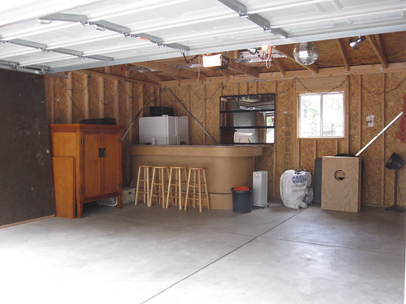
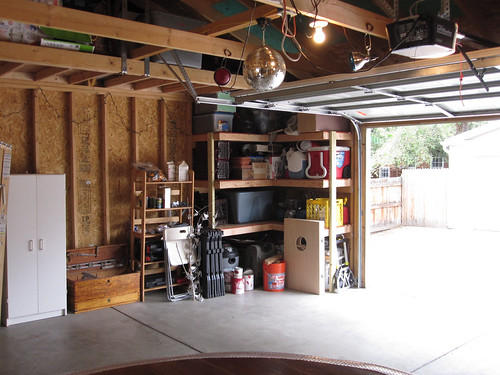
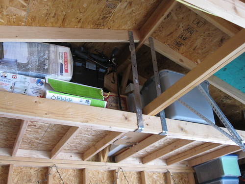
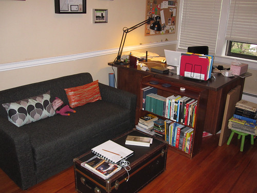
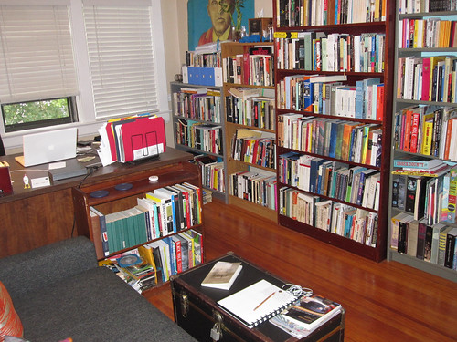

There is currently a small insect on its back, wriggling helplessly on my desk.

I have given it something to grab onto, and it is now right-side up.

For some reason or another, I have started using wood pencils again.

I had been using Pentel "Quicker Clicker" mechanical pencils for more than 10 years.

Mechanical pencils never quite attain an "optimal dullness."

