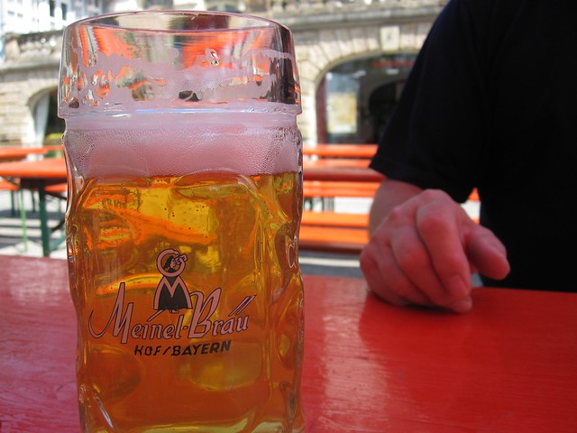
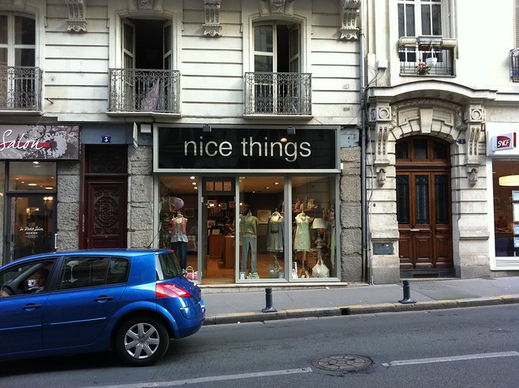
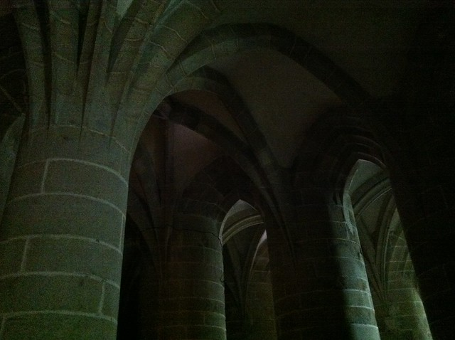
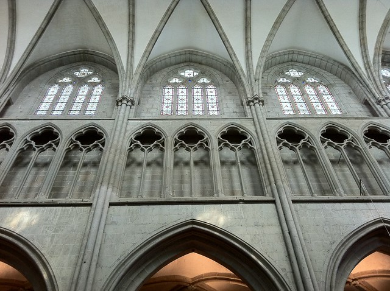
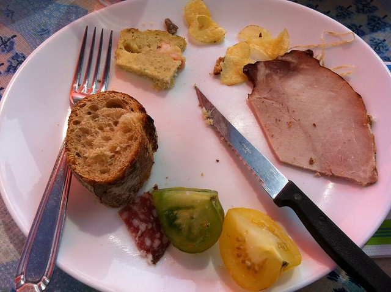
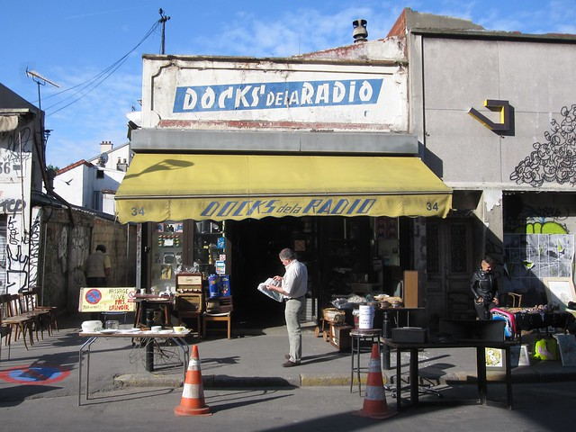
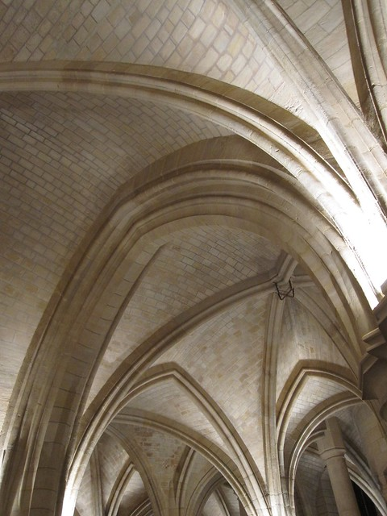
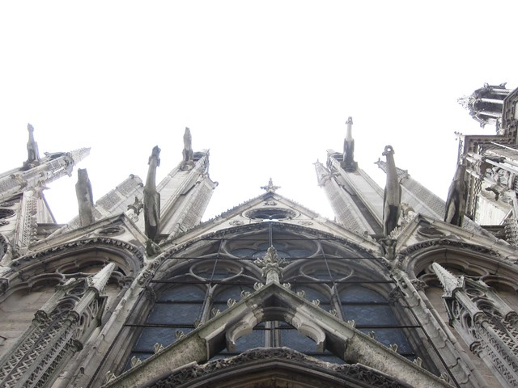
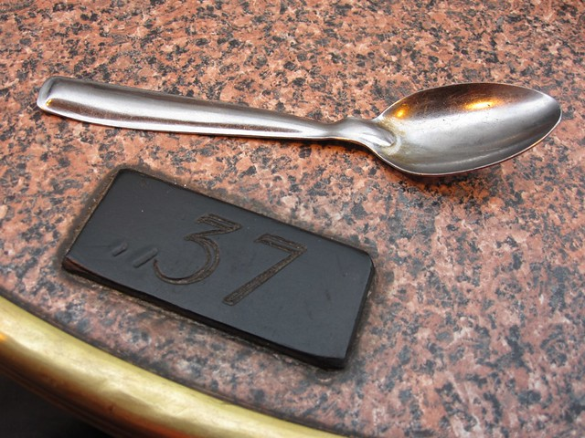

The answer to the above question is this: The kind of idiot whose father takes approximately 2000 photos during 16 days in Europe. Although, if you average that out, that's only 125 photos a day, which doesn't actually sound like all that much. Or does it?

In any case, I didn't take very many pictures while visiting various places in Germany and France because I knew my father would. What that means though is that now, here, I don't have all that many photos to show those few people who read this blog, and who might also be interested in this proxy slide show (at least I don't have you trapped in a darkened living room, with a whirring slide projector, not enough alcohol, a dog trying to hump your leg, and my droning voice going on and on and on about Gothic arches).

The above is not a description of my father, either. I don't know what he's going to do with his 2000 photos, but he's not going to turn them into slides and force guests to look at them after a heavy dinner, and he's probably not going to put them on the internet either, which is too bad, because if he just would, then I could point you to them. He captured a lot more awesome stuff than I did--and not simply via sheer numbers either. Here's an example:

[ed. 20250915: I have no idea what the example was]

The weekend before my parents arrived, I visited the Reißer family in Döhlau, which is a village outside of Hof, in northern Bavaria. The Reißers are the people who very kindly kept me for a year as a foreign exchange student in the early 90s. It was really wonderful to see them. I had a lovely time, but I didn't take very many pictures, and this is as close as I got to photographing a person while I was there (ridiculous!):

That arm, by the way, belongs to Karlheinz, who is a really great guy. Anyway, you can see all of the very few photos I took while there by clicking on the picture.

The above example actually suggests yet another answer to the question in the title: The idiot who writes this blog.

So, after a lovely Easter weekend with Loni, Karlheinz, and Julia Reißer, mom and dad came to Germany, we went lots of awesome places, and I didn't take very many pictures. I certainly didn't take any pictures of Tübingen, because I live here, and I don't need to be a tourist in my own town (ridiculous!).

We then went up to Hamburg, where we visited the the Cummerows (who were my neighbors in Döhlau in the early 90s), and where we also met a distant relative, who looks like me and my dad, and who showed us around the Emigration Museum. And guess what: I didn't take a single picture of any of it! Ridiculous! (But at least this time I can say that my dad did, right?) We had a lovely time with the Cummerows (and their respective families). We also really enjoyed meeting Jürgen.

After that, we came back to Tübingen for a couple of days so that I could teach my class, and then we went to France, where we visited a woman who stayed with us as a foreign exchange student for a month in 1980. Christine lives in Angers with her two sons whose names I remember but cannot spell. Here's a picture I took in Angers:

This is the sort of thing I photograph instead of, you know, the people who took excellent care of us in Germany and France.

Christine (who did, by the way, take exceptional care of us) showed us all around Angers, and then also took us (along with her parents) to see Mont St. Michel, where I took this picture:

At Mont St. Michel, we were met by Christine's friend Gilles (a high school librarian and HUGE sci-fi/fantasy fan who DOESN'T like Buffy, what?!?!?), who then acted as tour guide and interpreter. We all went back to his house in Dol-de-Bretagne, a beautiful medieval city in Brittany, where I took this picture:

and this picture:

Those heirloom tomatoes, by the way, were the most delicious tomatoes I've ever eaten in my whole life.

Christine, her sons, her parents, and her friends were all warm and generous and wonderful, and I didn't take a picture of one single one of them (my dad, on the other hand, took dozens of pictures of all of them, and if he would just put his photos online, you could look at them).

Then we went to Paris for one day and two nights, which is not even really any time at all to see Paris, and I still managed to take more photos there than anywhere else on the whole trip. I do not know how these things work.

At a huge flea market near Place Django Reinhardt.

This is me droning on and on and on about Gothic arches.

Part of Notre Dame du Paris being swallowed by the sky.

The table at the cafe where a strange adventure started.

So yeah. I'm a dummy.

Thanks, Mom & Dad & Familie Reißer & Familie Cummerow & Famille Belanton & Famille Toutain & Gilles & Nathalie & Juliette, but especially Mom & Dad. I had a lot of fun, even if you can't see photos of that fun.
