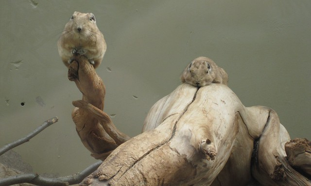
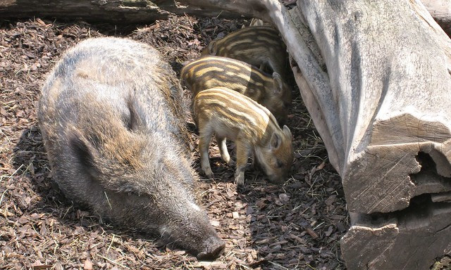
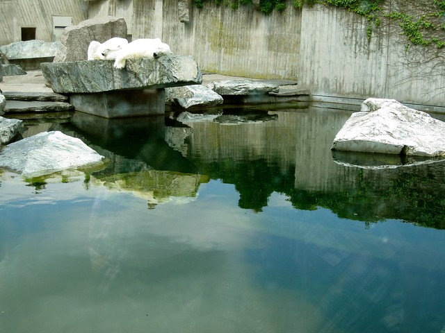
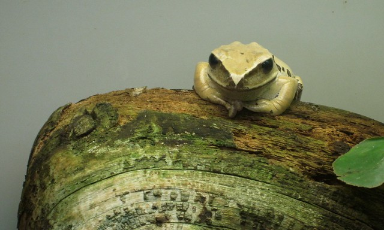

Last Thursday was a holiday, and so Jane, Martini, Bambi, and I went to Stuttgart for the day. We spent most of the day at the [Wilhelma](https://secure.wikimedia.org/wikipedia/en/wiki/Wilhelma "the wikipedia page on the Wilhelma"), Stuttgart's zoo taking pictures (both Bambi and Martini took around 650 apiece). After many hours at the zoo, we went into Stuttgart, wandered around, took fewer pictures, drank beer, and ate, among other things, too much candy. It was a great day, and the four of us had a really good time, though we missed Katie (my office mate), who was going to join us, but who decided that perhaps she should spend the day grading a mountain of papers so that she wouldn't have to grade on, this, her birthday weekend.

Here are several pictures I took. You can see the whole flickr set by clicking on any one of them.

