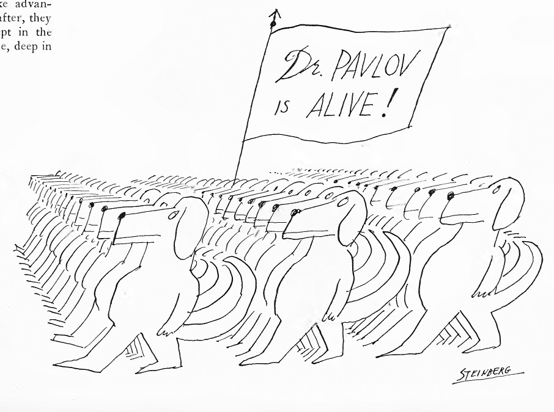

Every morning, I wake up and immediately check my email, then Facebook, then Tumblr, then whatever else. It usually takes an hour. What if I were to stop doing those things? What if I spent that hour writing? Or even reading? What exactly do I expect to get from the constant checking, constant validation? Only if there are likes and comments, right?

Some days, I think about quitting all of the so-called social media to which I am connected. I obviously haven't done it yet. But what do I get from it?

Every once in a while, there's an extremely evocative image on Tumblr, something that gets me thinking, but I rarely ever do anything with those thoughts. Sometimes I respond, in a way, on my own Tumblr, with another image. In many ways, Tumblr is a record of certain obsessions, but mostly it's just me reblogging other people's stuff. I mean, I have been reading about Diane Arbus and looking at her work for weeks now, but I haven't posted any of her work on my Tumblr.

And Facebook? What do I get from Facebook? I know that person X ran 30+ miles last week, that person Y was frustrated with American politics, and that person Z posted about doing something I wish I were doing (reading more, writing more). But, oh man, if I post something, and people like it and comment on it, then hooray! and the pleasure centers in my brain light up and I want more and more and more.

What is the purpose of this post? Am I hoping that my six readers will comment here? Did I purposefully underestimate my number of readers to elicit sympathy (and hopefully comments)?

Some weeks ago, I was talking to a friend about why I do such a poor job of sending my work to journals and magazines and publishers, and, in a moment of sudden and brutal honesty, I realized/admitted that I'm not afraid of rejection so much as I am afraid that no one will read me.

I wasn't underestimating by much, this blog only got 11 hits last week, but I am also aware that if I posted more frequently, there would be more to read, and more people would probably read that more to read.

Here is one of my favorite cartoons ever:

  
Steinberg, Saul. Cartoon. _The New Yorker_ \[New York\] 16 Nov. 1968: 59.
