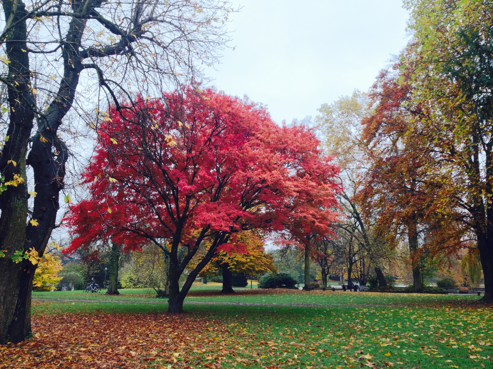

0. While Listening to [Henry Plotkin](https://www.youtube.com/watch?v=XRYev0MMlFo)

1. I was cold and sweating. I was sweaty cold. As I warmed, the sweat cooled, making me colder as I got warmer. I stopped the bike to photograph a tree, and the gear slipped as I slowed. My feet nearly slipped off the pedals as well. I had trouble keeping the bicycle upright between my legs. I rode all the way around the tree once to find the angle that best combined form and color. Perhaps I should have photographed the tree from multiple angles. As it was, what I felt was the best angle included the bums on the bench in the distance. When I initially rode past them, one of them was speaking in a voice made of gravel. Gravel always "crunches." Breakfast cereal always "crunches." First I was cold and sweating, but now I'm just cold.

2. Having just read [a poem, an unfinished poem by Michael P.](http://dadoodoflow.tumblr.com/post/102544478393/stripped-fetters-that-thing-you-believe-in) and being struck more than once, I mean a chord within me was—and but now also listening to exceptionally accomplished modernist music by an eleven-year-old—and wanting to continue the striking poem, continue examining my own beliefs and/or continue adding and modifying the existing structure so that it changes without changing, standing in a river, buying but never opening a box of colored pencils, wanting to make the joke "pencils of color," but knowing better, and also being aware of the ease with which I just couched that joke like I thought you wouldn't notice, like how his eye is on a slow journey to his chin, how I probably over-sharpen my pencils and too soon, like how characters allow us to do and say things . . . even though how is this not also a character, and the inability to write without thinking about a reader and being judged by that reader so that I would be forced to admit that yes, in fact, there is a God. Yes, there is, in fact, a God. There is also a button on my desk, a mother-of-pearl button shiny and opalescent on one side, mottled red and brown on the other and I always think of blood and I always think of blood. "Bloody Buttons" would not even be a good name for a band. My belief that I have something to say and it's important. My belief that I have nothing to say and it isn't important. Or rather that I have something to say and it isn't important when what I really want is to have nothing to say and for it to be important. My belief in hope. My belief in pencil sharpeners. My belief in my essential unbelievability. I mean, that I should not be believed. Not because I am a liar, but because, perhaps, I don't even know I'm not telling the truth. So much of this is philosophy for neophytes. and then what seems to have been out of rhythm resolves itself into the larger complex of sounds. Complex of apartments.

3. My writing feels stalled in the same way my life feels stalled. Trying to make something new and interesting from something that's been done and overdone. Writing about writing for Christ's sake. I mean look at this! Or maybe always on the cusp of something and never pushing or working hard enough. Not having a practice. What is a practice? Going into private practice.

4. 
