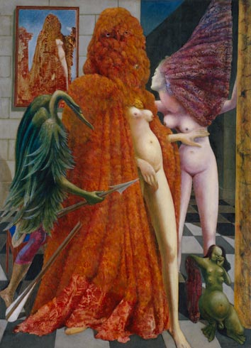
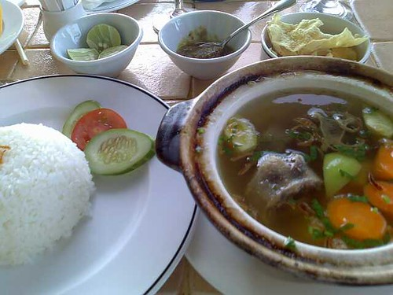

\[To view the post in its original context, click [here](2009-03-24-blood-from-the-shoulder-of-pallas.md). One of the things I like best about this post now, several years later, are the broken images.\]

\[text from _Watchmen_; images borrowed from the internet\]

"Is it possible, I wonder, to study a bird so closely, to observe and catalogue its peculiarities in such minute detail that it becomes invisible?"

"I believe that in approaching our subject with the sensibilities of statisticians and dissectionists, we distance ourselves increasingly from the marvelous and spell-binding planet of imagination whose gravity drew us to our studies in the first place."

"Until we transform our mere sightings into genuine visions; until our ear is mature enough to order a symphony from the shrill pandemonium of the aviary; until then we may have a hobby, but we shall not have a passion."

"unwittingly refined from the original gleaming ore down to a banal and lusterless filing system."

"We were not twitching nervelessly in stifling, stinking darkness, head first down the gullet of the swooping horror, our tails dangling pathetically from that vicious scimitar beak for hours before finally our hind legs and pelvic girdle are disgorged, our empty, matted skin curiously inverted by the process."

". . . antique and functional stretches of descriptive prose which nonetheless conveyed the violent and terrible essence of their subject matter effortlessly."

